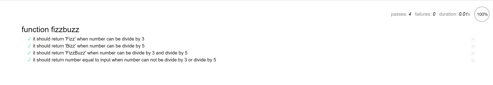

# **單元測試(Unit test)練習：FizzBuzz**

## 說明

FizzBuzz 程式是經典的面試考題之一。我們會將一個大於 0 的整數傳到 fizzBuzz() 函式，並且該函式可以依下面的規則回傳結果

若該整數能被 3 整除，回傳 Fizz；
若該整數能被 5 整除，回傳 Buzz；
若該整數能被 3 和 5 同時整除，回傳 FizzBuzz；
若都不能整除，回傳該整數。

## 目的

**熟練軟體測試之〈單元測試 Unit test〉**

單元測試（Unit Test）：針對個別的類別和方法，測試執行結果符合預期。通常會由撰寫功能的人自行撰寫單元測試，因為開發者最清楚程式碼的內部結構。

軟體測試除〈單元測試〉外，還有：

- 整合測試（Integration Test）：在各個功能整合之後，就整個系統，測試元件之間的互動正確。
- 驗收測試（Acceptance Test）：從使用者的觀點測試整個軟體是否符合使用者的需求，而不管程式碼內部的運作，通常由專門的軟體品質測試工程師（QA 工程師）來負責。

## 工具及參考

- **測試工具：Mocha(js 的框架) 和 Chai(一種斷言庫)**

- [Mocha](https://mochajs.org/)

- [Chai](https://www.chaijs.com/api/)

- [單元測試：Mocha、Chai 和 Sinon](https://cythilya.github.io/2017/09/17/unit-test-with-mocha-chai-and-sinon/)

- [軟體測試的四個階段，單元測試、整合測試、系統測試、驗收測試](https://www.itread01.com/content/1547157994.html)

## 構思

設計四個測試案例：

- [case 1] input: 9, expect output : Fizz
- [case 2] input: 10, expect output : Buzz
- [case 3] input: 15, expect output : FizzBuzz
- [case 4] input: 8, expect output : 8

## 實作

[**fizzBuzz.js**](https://github.com/s19003045/AC-project-FizzBuzz/blob/master/js/fizzbuzz.js)，程式碼如下：

```js
function fizzBuzz(num) {
  let str = "";
  if (num % 3 === 0) {
    str += "Fizz";
  }
  if (num % 5 === 0) {
    str += "Buzz";
  }
  if (str != "") {
    return str;
  } else {
    return num;
  }
}
```

[**fizz_buzz.js**](https://github.com/s19003045/AC-project-FizzBuzz/blob/master/test/fizzbuzz_spec.js)，程式碼如下：

```js
// [case 1] input: 9, expect output: Fizz
// [case 2]input: 10, expect output: Buzz
// [case 3]input: 15, expect output: FizzBuzz
// [case 4]input: 8, expect output: 8
var should = chai.should();
describe("function fizzbuzz", function() {
  it("it should return 'Fizz' when number can be divide by 3", function() {
    let num = 9;
    let result = fizzBuzz(num);
    result.should.be.equal("Fizz");
  });
  it("it should return 'Bizz' when number can be divide by 5", function() {
    let num = 10;
    let result = fizzBuzz(num);
    result.should.be.equal("Buzz");
  });
  it("it should return 'FizzBuzz' when number can be divide by 3 and divide by 5", function() {
    let num = 15;
    let result = fizzBuzz(num);
    result.should.be.equal("FizzBuzz");
  });
  it("it should return number equal to input when number can not be divide by 3 or divide by 5", function() {
    let num = 8;
    let result = fizzBuzz(num);
    result.should.be.equal(num);
  });
});
```

output：

